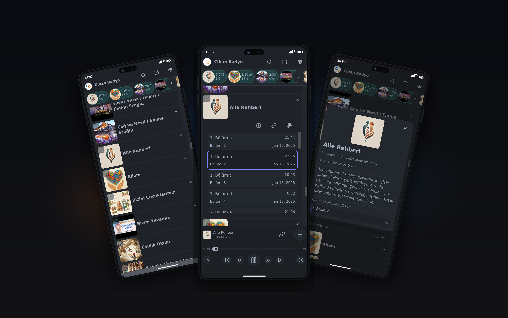

# RadioWebApp

A configurable radio and podcast player for live streams and RSS archives shipped as a PWA/TWA mobile app in IOS, and Android
app stores.
Listeners get lock-screen controls, continue-listening, Turkish-aware search,
and Google Drive sync of progress and favorites.

<p align="center">
  
</p>

## Features

- **Live radio** — stream playback, now-playing metadata, and a stream refresh
  when playback stalls
- **Podcast archive** — RSS feeds parsed in the browser, cached locally, and
  refreshed in the background
- **Player** — skip, speed, volume, autoplay next episode, resume last content,
  and Media Session lock-screen / headset controls
- **Continue listening** — in-progress episodes and recently played stations
- **Search** — Turkish-aware folding, exact vs similar matches, title and
  episode hits
- **Share links** — deep links to a station, episode, or timestamp
- **Favorites, theme, language** — persisted locally; optional Google Drive
  `appDataFolder` sync across devices (English / Türkçe)
- **Installable** — PWA on supported browsers, plus a Trusted Web Activity
  wrapper for Android

## Stack

SvelteKit 2 · Svelte 5 · TypeScript · Vite · Tailwind CSS · DaisyUI · Lucide ·
Node adapter · `@vite-pwa/sveltekit` · Google Auth / Drive · Bubblewrap TWA ·
Docker

## How it is put together

```
Remote config (stations, RSS list, branding, favicon)
        │
        ▼
   SvelteKit app  ──HTML5 audio──▶  live stream or episode file
        │                              Media Session metadata
        ├─ RSS worker pool (backoff, local cache)
        ├─ localStorage (progress, favorites, settings)
        └─ optional Google Drive appData sync
```

**Config** is fetched at `npm run setup` from `CONFIG_URL` into
`src/lib/config/config.ts`. Shape lives in `src/lib/config/config.example.ts`:
website copy and links, radio streams (and optional now-playing URLs), and a
text file of podcast RSS URLs.

**Podcasts** are fetched from that list with concurrency limits and retries,
then cached so a large archive still opens quickly. **Radio** now-playing
info is polled independently of playback.

**Auth** is Google OAuth with the Drive app-data scope only. Favorites,
progress, and settings sync; podcast/radio caches stay on the device.

Build also writes SEO artifacts: Open Graph image, sitemap, robots.txt,
Digital Asset Links, and a podcast snapshot used for JSON-LD
(`RadioStation` / `PodcastSeries`).

## Getting started

Node 20+. Copy `.env` with at least:

| Variable | Used for |
| --- | --- |
| `CONFIG_URL` | Remote `config.ts` |
| `FAVICON_URL` | Site / PWA icon |
| `SPLASH_SCREEN_COLOR` | PWA theme and OG background |
| `GOOGLE_CLIENT_ID` / `GOOGLE_CLIENT_SECRET` | Optional Drive sync |

```bash
npm install
npm run setup          # pull config + favicon
npm run dev
```

`npm run build` runs setup, SEO, and asset links, then a Node production
bundle. `npm run preview` serves that bundle.

## Scripts

| Command | What |
| --- | --- |
| `npm run setup` | Fetch config and favicon |
| `npm run dev` | Vite dev server |
| `npm run build` | Setup + SEO + asset links + production build |
| `npm run seo` | OG image, sitemap, podcast snapshot |
| `npm run deploy` / `deploy:beta` | Copy `build/` to `DEPLOY_BUILD_PATH` |
| `npm run twa:init` / `twa:update` / `twa:build` | Android TWA via Bubblewrap |

## PWA and Android

The Vite PWA plugin emits a service worker and `manifest.json` (standalone,
maskable icons, screenshots). Settings can prompt install, or show
browser-specific add-to-home-screen steps (including iOS).

Android packaging uses [Bubblewrap](https://github.com/GoogleChromeLabs/bubblewrap)
against the live manifest (`TWA_DIRECTORY`, `TWA_MANIFEST_URL`).
`npm run assetlinks` writes `.well-known/assetlinks.json` from the signing
keystore so the TWA can open as the installed app.

## Deploy

`adapter-node` output is copied to `DEPLOY_BUILD_PATH` (append `-beta` for the
beta command). The `Dockerfile` runs that Node server on port 3000 and reloads
when `build/` changes.
